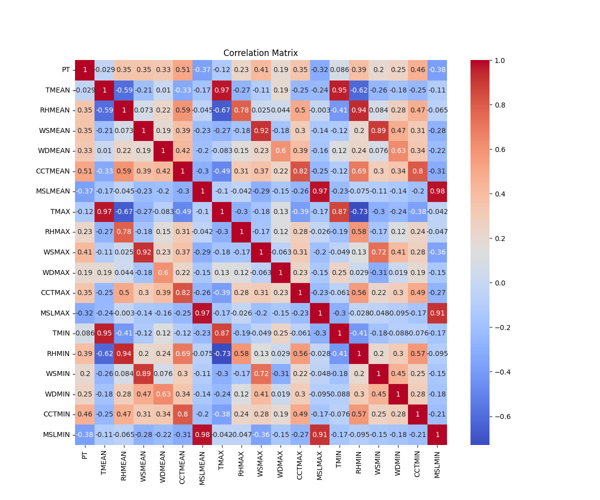

# Basel Precipitaion Forecast Using Machine Learning Models

In this project we train some models for predicting precipitation based on other parameters.

## Correlation Analysis

Here is the strength of relationship between each pair:

Some interesting facts about the above fogure is that the correlation coefficient between:

- Precipitation and Temperature is close to zero.
- Precipitation and Cloud Cover is relatively high positive.
- Precipitation and Max Wind Speed is relatively high positive.
- Precipitation and Mean Sea Level Pressure is relatively high negative.

## Results

Results show that ensemble models have better performance for this structured data:

| Model             | Train Score       | Test Score    |
|------------------:|------------------:|--------------:|
| Gradient Boosting | 0.79              | 0.60          |
| RandomForest      | 0.94              | 0.55          |
| nn_model3         | 0.53              | 0.46          |
| nn_model1         | 0.52              | 0.44          |
| Linear            | 0.48              | 0.43          |
| nn_model2         | 0.38              | 0.41          |

For more information see [report.ipynb](https://github.com/fraxea/weather/blob/main/report.ipynb)

### Resource

- [Meteoblue:](https://www.meteoblue.com/en/weather/archive/export) Temperature, Precipitation, Relative humidity, Wind speed, Total cloud cover, Pressure
